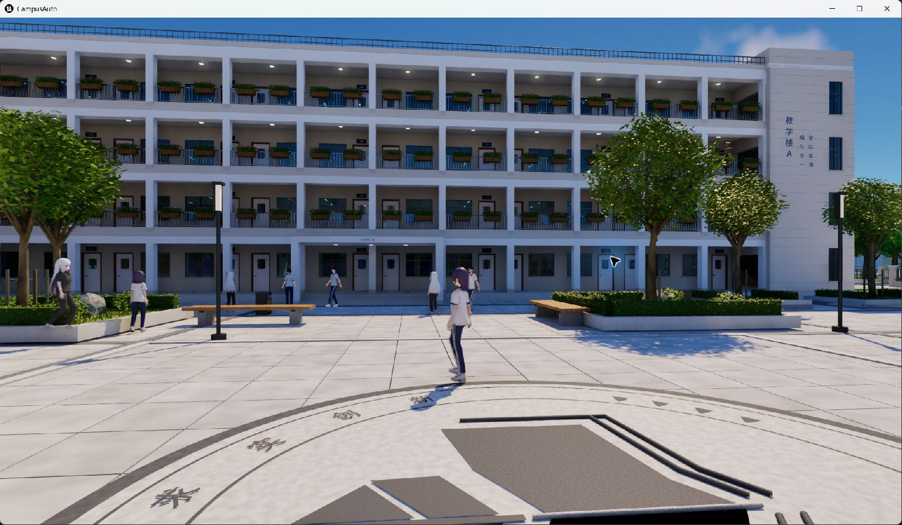
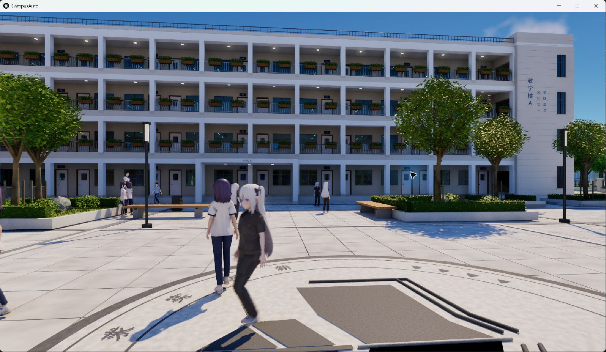

# scene 关卡 Shipping 游戏实测性能报告

**日期：2026-10-02（Asia/Shanghai）｜范围：实际打包游戏运行、性能采样与方案；未实施修复。**

## 结论

已运行 `/Game/Campus/Maps/scene` 的 Win64 Shipping 游戏。教学楼 A 前、包含树木和活动 NPC 的同一固定视点，三轮各 60 秒正式采样合计 **7,095 帧**，平均应用帧率 **39.45 FPS**，帧时 **P95 34.94 ms、P99 37.15 ms**，**1% low 25.90 FPS**。全部有效帧均保留，最大帧时 **48.26 ms**，没有超过 50 ms 或 100 ms 的帧。

这里的 FPS 是外部采集的**游戏应用 Present 完成频率**，不是已验证的屏幕实际显示帧率。测试请求 1920×1080、100% ScreenPercentage、Epic 质量；实际渲染后缓冲尺寸未直接读取。因此本报告可作为这台机器、这份 Shipping 包和这个视点的实测基准，不能作为严格原生 1080p、全校园路线或其他机器的性能承诺。

正式三轮整卡 GPU 利用率均值 **98.43%**，区间 **96–99%**，提示优先核查运行时渲染负载；尚无逐帧 GPU、GameThread、RenderThread 或具体渲染 pass 数据，不能据此把瓶颈归因到某个 pass。第二次启动的独立样本记录 **907.06 ms、414.06 ms** 两个超过 100 ms 的长帧，需与稳定运行分开处理。

**发布构建仍有阻塞：标准 BuildCookRun 因缺少 GameFeatureData 资产管理规则失败（退出码 25）。** 本次运行的是复用已写出 cook 产品，经 `-skipbuild -skipcook` 完成 staging、pak、IoStore 和 archive 的 **Shipping 诊断包**（退出码 0），并不代表标准打包已通过发布验收。未修改该错误或其他性能问题。

## 1. 包体与测试环境

| 项目 | 实测条件 / 身份 |
| --- | --- |
| 引擎 | UE 5.8.2，CL 56702186 |
| 平台 / 构建 | Windows x64，Shipping 诊断包；不是 PIE 或 Development |
| CPU | AMD Ryzen 7 5700X，8 核 / 16 逻辑处理器 |
| GPU | NVIDIA RTX 4060 Ti 16 GB；nvidia-smi 总显存 16,380 MiB |
| NVIDIA 驱动 | 610.47（Windows 驱动版本 32.0.16.1047） |
| 系统内存 | 标称 16 GB，系统可见约 15.88 GiB |
| 显示环境 | 存在 GameViewer Virtual Display Adapter；非直接物理显示器独占测试 |
| 运行进程 | `CampusAuto-Win64-Shipping.exe`，正式采样 PID 25560 |
| 启动参数 | `-windowed -ResX=1920 -ResY=1080 -ForceRes -NoSplash -textconfig` |
| 质量配置 | 十组主要 `sg.*=3`（Epic），`r.ScreenPercentage=100` |
| 动态分辨率 / 限帧 | `r.DynamicRes.OperationMode=0`、`r.VSync=0`、`t.MaxFPS=0`；保存的用户设置也为 VSync=False、动态分辨率=False、FrameRateLimit=0 |
| 缓存状态 | 第二次启动、已预热；没有清理 OS 文件缓存或显卡驱动缓存 |
| 场景状态 | 玩家固定站立；NPC 保持活动；未暂停游戏、隐藏 NPC 或降低画质 |

正式采样前开启**测试包专用** `UserEngine.ini` 的 `bAllowHighDPIInGameMode=True`，配合 `-textconfig`；进程 DPI awareness 查询为 2、HRESULT=0。窗口截图尺寸为 1538×895，含窗口边框。DPI awareness、请求分辨率和截图尺寸都不等同于已验证的渲染后缓冲尺寸；原项目没有改 DPI 设置。

源关卡为 `Content/Campus/Maps/scene.umap`，422,604,172 字节，最后保存时间 2026-10-01 17:28:52。SHA-256：

```text
29706436e1b2365f561968f7d4d6f53b67780034180c55b3d364c8443c8bf8cb
```

实际运行的 Shipping EXE 为 169,294,848 字节，SHA-256：

```text
4701151b6a5ccb54cc554e232e16bba5997698d04b8daa9b8143c7d169b0f1ad
```

诊断包初始产物为 26 个文件、1,396,240,736 字节（约 1.30 GiB）；实际运行测试目录添加了 70 字节的 `UserEngine.ini`，为 27 个文件、1,396,240,806 字节。从实际 pak 提取的 `DefaultEngine.ini` 已核对默认地图、Epic、ScreenPercentage、动态分辨率、VSync 和 MaxFPS，其 SHA-256 为 `25f688165b68f019c235de99c899b932849099e85fc28a5086f5204427d3ca4a`。配置证明的是测试输入；本次没有逐项查询所有运行时渲染变量，也未确认 Lumen 硬件光追的实际运行状态。

## 2. 打包过程与未修复的构建问题

为避免触发原关卡保存或同步写入，先物理复制 `Content`、`Source`、`Config` 与 `.uproject` 到输出目录内的独立项目；没有使用共享文件或目录链接。测试副本把 GameDefaultMap 指向 scene，追加上述采样画质配置。构建子进程使用 `CAMPUS_EDITABLE_ISM_DISABLE=1` 避免编辑器 Python 自动同步钩子写入；它不是游戏运行时的降负载措施。

| 阶段 | 时间（北京时间） | 结果 |
| --- | --- | --- |
| 标准 Shipping BuildCookRun，`-build -cook -map=/Game/Campus/Maps/scene` | 10-01 23:39:06–23:54:21 | 编译完成，cook 产品写出且 finalisation 完成；整次 UAT 失败，退出码 25 |
| 复用 cook 产品，`-skipbuild -skipcook -stage -pak -iostore -package -archive` | 10-01 23:57:55–23:58:58 | `BUILD SUCCESSFUL`，退出码 0；生成本次诊断包 |

标准 cook 日志最终显示 15,060 packages、remain=0；细分为 **15,053 cooked + 7 platform-skipped**，随后仍因两条 GameFeatureData 配置错误导致 UnrealEditor-Cmd 退出 1。两条错误源于同一个缺失规则：

```text
Asset manager settings do not include a rule for assets of type GameFeatureData
```

这不是“标准完整构建成功”，也没有通过消除错误、修改资产管理配置或压制日志来获得成功状态。构建时的 GC、着色器编译和内存压力日志属于 cook 阶段，不能直接用来解释下表的游戏运行帧时。

## 3. 采集方法与统计定义

使用官方 **PresentMon 2.6.0** 外部 ETW 采集，并按实际游戏 PID 与 swapchain `0x1EB37E84180` 筛选。正式三轮均为同一 DXGI 链，SyncInterval=0。SyncInterval=0 并不能排除系统或驱动层的其他调度、限帧因素。

本机首次尝试 GPU/display 完整追踪时，采集进程退出 0，但没有产生有效帧 CSV；原因未确证。改用 CPU-only 方式后成功获得 CSV。命令包含 `--v2_metrics --qpc_time_ms --no_track_display --no_track_gpu --no_track_input --track_etw_status`；没有把缺失 GPU / 显示字段补成 0。

Shipping 默认没有启用本项目所需的内置 CSV / trace；部分调试启动参数和地图覆盖也受 Shipping 条件编译限制。本轮没有重编译插桩 Shipping 或改用 Development 冒充发布版本，所以无法提供 UE 线程/pass 的内部耗时。

- `FrameTime` 是相邻应用 Present 返回/完成之间的间隔；平均 FPS=`1000 / 平均 FrameTime(ms)`。
- 1% low=`1000 / 最慢 ceil(N×1%) 帧的平均帧时`，不是第 99 百分位帧时的倒数。
- P95 / P99 对排序后的样本按 `(N−1)×p` 线性插值。
- 不裁掉首尾、预热帧或高百分位；每份选定 CSV 的全部有效正帧均保留。正式合并统计对 7,095 个原始帧重新计算，未平均每轮 P95 或 1% low。
- PresentMon `CPUBusy` 属于外部推导的时间区间，不能当成 CPU 核心实际忙碌时间，更不能当成 GameThread。
- CPU 使用量另外取进程内核+用户累计 CPU 秒；除以采样墙钟秒得到单核等效，再除 16 得整机逻辑处理器占比。
- GPU、显存、温度、电力取 `nvidia-smi` 约 1 秒整卡采样，含其他应用及显示合成成本，不能按游戏 PID 或单帧归属。

正式三轮 177 条 ETW 状态记录中的 `EventsLost`、`BuffersLost`、`OverflowedPresents` 全部为 0；工具退出码均为 0。此结果支持采集完整性，但不能代替屏幕显示链路验证。

## 4. 正式固定视点结果

镜头正对教学楼 A，包含广场树木、花坛、建筑走廊和活动 NPC。各轮之间仅取截图核验，不发送游戏移动或转向输入；起始及三轮结束的建筑、地面轮廓一致，NPC 位置随时间变化。



| 样本 | 采集时间（10-02，北京时间） | 有效帧 | 平均 FPS | 平均帧时 | P95 | P99 | 1% low | 最大帧时 |
| --- | --- | ---: | ---: | ---: | ---: | ---: | ---: | ---: |
| confirmed_fixed_01 | 00:30:43.708–00:31:44.796 | 2,378 | 39.67 | 25.21 ms | 34.68 ms | 37.01 ms | 26.00 | 44.37 ms |
| confirmed_fixed_02 | 00:32:03.900–00:33:04.985 | 2,366 | 39.46 | 25.34 ms | 35.06 ms | 36.74 ms | 26.00 | 42.22 ms |
| confirmed_fixed_03 | 00:33:27.409–00:34:28.490 | 2,351 | 39.22 | 25.50 ms | 35.08 ms | 37.39 ms | 25.79 | 48.26 ms |
| 三轮逐帧合并 | 三个独立区间 | **7,095** | **39.45** | **25.35 ms** | **34.94 ms** | **37.15 ms** | **25.90** | **48.26 ms** |

每轮请求 60 秒，采集器实际生命周期约 61.08–61.09 秒；CSV 有效帧间隔之和分别为 59.940 / 59.954 / 59.947 秒，共 **179.842 秒**。这些时间口径分别记录，没有用工具生命周期内的加载/收尾时间强行稀释帧率。各轮有效正帧数等于选定链的原始帧数，0 帧因数值无效而排除。

合并帧时中位数为 24.77 ms，最慢 1% 为 71 帧、平均 38.61 ms。三轮平均帧率区间 39.22–39.67 FPS；稳定性相近，但距离假设的 60 FPS（16.67 ms）预算仍有差距。60 FPS 尚非用户指定验收标准，也未在本轮达成。



### 运行资源

| 指标 | 三轮结果 | 解释边界 |
| --- | --- | --- |
| GPU 利用率 | 整卡 183 样本，均值 98.43%，96–99% | 高渲染负载线索；不等于逐帧 GPU 时间 |
| 显存使用 | 整卡均值 7,353 MiB，7,310–7,414 MiB | 未接近整卡 16,380 MiB 容量；没有进程显存预算/驻留量测量 |
| GPU 温度 / 电力 | 58–61°C；均值 133.26 W，130.82–135.64 W | 采样未见明显过热线索；未完整采集节流原因 |
| 游戏 CPU | 955.266 CPU 秒 / 183.095 资源墙钟秒 = 5.22 单核等效；约 32.61% 整机逻辑处理器容量 | 不排除某个关键线程饱和 |
| 游戏驻留工作集 | 各轮均值约 3.19 / 3.18 / 3.01 GiB，范围 2.83–3.19 GiB | WorkingSet；历史峰值 5.29 GiB 不是本三轮峰值 |
| 游戏私有提交内存 | 各轮均值约 10.20–10.21 GiB，范围 10.17–10.27 GiB | PrivateUsage，不能解释为驻留 RAM |
| 系统可用 RAM | 4.53–5.15 GiB | 本次没有证明 RAM 用尽或磁盘换页导致低帧率 |

进程 PageFaultCount 每轮增长约 789–798 万。该计数包含软缺页，未采集硬缺页、磁盘换页 I/O 及逐帧时间关联；不能把这个数直接认定为磁盘抖动或内存泄漏。工作集在第三轮下降也需结合操作系统内存管理进一步核查。

## 5. 启动样本与短时转向

### 第二次启动观测

进程启动为 00:09:09.101，采集器 00:09:09.293–00:10:40.386，请求 90 秒、实际生命周期 91.093 秒。获得 3,234 个有效帧、80.343 秒帧间隔；89 条 ETW 状态记录的丢失/溢出均为 0。

首个 CSV 帧所引用的前一 Present 完成点约在进程启动后 **9.906 秒**，该帧自身完成约在启动后 **10.813 秒**。这只是外部捕获时间点，**不是已确认的首次可见画面或关卡可操作时间**；首次 Present 之前的加载没有算进 FPS。

| 指标 | 启动样本 |
| --- | ---: |
| 平均应用 FPS | 40.25 |
| P95 / P99 | 34.01 / 36.72 ms |
| 1% low | 12.97 FPS |
| >50 ms / >100 ms 帧数 | 3 / 2 |
| 最大 / 次大长帧 | 907.06 / 414.06 ms |

907.06 ms 首帧有内部前一 Present 历史，按有效正帧保留，没有以“首帧”名义删除。尚未同步采集 PSO、流送、磁盘、UE 线程或 GC 事件，不能确定这两个长帧的原因。此为第二次启动，未清缓存，不能冠以“真正冷启动成绩”。

### 辅助转向片段

`courtyard_turn_01` 在 00:35:04.384–00:36:05.479 采集，包含 3 次人工模拟鼠标转向及静止间隔，出现俯看地面、仰看天空和不同广场方向；2,601 帧，平均应用 FPS **43.40**、P95 **31.46 ms**、1% low **27.09 FPS**、最大 **41.43 ms**，无 >50 / >100 ms 帧。

该样本包含界面自动化和截图开销，镜头负载变化较大，没有完成可重复的连续行走路线，不与固定视点作性能提升比较，也未并入正式基准。采样后的键盘尝试不属于此样本。全校园穿行、森林边缘、室内、多个 NPC 密集区、冷缓存重复启动和长时间运行尚未覆盖。

### 排除样本

此前 `courtyard_fixed_01/02/03` 结束核验时视线转向地面，无法确认采样期间固定视点，三份原始数据保留，但从正式统计全部排除；其约 59.5 FPS **不能代表教学楼 A 正面基准**。首次 GPU/display 完整追踪没有有效 CSV；`cpu_only_probe` 仅为工具与字段验证，均不作为正式成绩。

## 6. 瓶颈判断与后续方案（未实施）

| 优先级 | 本次证据 | 建议与验收 |
| --- | --- | --- |
| P0：发布构建链路 | 标准 UAT 退出 25，GameFeatureData 规则缺失 | 审核所用 GameFeature 插件和 AssetManager 配置，制定规则修复方案；另行授权实施后，用完整 `-build -cook` 成功退出及启动回归验收，不能长期用 skipcook 替代 |
| P1：运行时渲染负载 | 正式视点约 39.45 FPS，整卡 GPU 持续 96–99% | 在直接显示器环境确认实际像素数与显示帧率；再用可诊断的对应构建或可靠 GPU 追踪，分离 GPU/GT/RT 与 VSM、BasePass、Lumen、植被成本。与本 Shipping 同资产/镜头/质量核对，以单项 A/B 的帧时变化验收 |
| P2：启动长帧 | 启动记录 907 / 414 ms，热稳定段未复现 >50 ms | 同步记录 PSO、流送、磁盘和 CPU 事件，分别测冷/热缓存；仅在时间关联确认后安排 PSO 预缓存、资产流送或加载方案，不直接认定为 PSO |
| P3：内存与路线覆盖 | 私有提交约 10.2 GiB、软/硬混合缺页计数较大，短样本未见 >50 ms | 记录提交量、驻留、硬缺页/换页 I/O 与帧时的关联；补完整校园路线和长时稳定性测试，再判断流送预算或泄漏 |

若目标以后定为稳定 60 FPS，应围绕 16.67 ms 帧预算验收每条代表路线的平均值、P95/P99 和长帧。本次平均应用间隔为 25.35 ms，但尚未分离关键路径，不能把差值直接当作某项优化的可兑现收益。

9 月 30 日编辑器报告的 TEDS/Mass 层级解析等待、保存/进入 PIE 的 ISM 全场同步是另一个执行环境的问题。本轮 Shipping 没有编辑器 UI，不将那些编辑器热点直接算作 Shipping 根因。两个报告的地图保存版本、镜头、像素数和采样方式不同，不计算“从 26 FPS 提升至 39 FPS”的优化倍率；本轮未实施性能修复。

## 7. 原项目保护与证据

原项目 `Source`、`Config`、`.uproject` 与 `scene.umap` 共 **94 个文件**的 SHA-256 与打包前基线一致；`Content` 共 **14,661 个文件**的路径、大小和修改时间清单一致。其余 Content 资产未逐一做全内容哈希，因此保护核验按上述覆盖范围表述。

游戏已通过正常关闭结束；外部采集进程已退出。新增内容为测试副本、包体、日志、CSV、统计与本报告，原项目未保存关卡、改资产、改配置或实施修复。Git 上传范围为本 Markdown 与两张报告截图，不上传游戏包体或项目修改。

本机证据根目录：`D:/project/UnrealProject/CampusAuto/outputs/SceneReleasePerformance_20261001/`。目录日期是任务开始日期，正式采样发生在 10 月 2 日。

| 文件 | 用途 |
| --- | --- |
| `build_metadata.json`、`build_uat.log` | 标准构建参数、退出码和 GameFeatureData 错误 |
| `diagnostic_package_metadata.json`、`diagnostic_package_uat.log` | skipbuild/skipcook 诊断打包流程与成功状态 |
| `PackageConfigEvidence/CampusAuto/Config/DefaultEngine.ini` | 从实际 pak 提取的测试输入 |
| `launch_1080p_native.json`、`GameUserSettings_observed.ini` | 实际 EXE、启动参数、DPI 查询、保存设置快照 |
| `confirmed_fixed_01/02/03.csv`及对应 `_metadata.json`、`_resources.json`、`_gpu.csv`、`_presentmon.log` | 正式逐帧和资源原始证据 |
| `confirmed_fixed_summary.json`、`confirmed_resource_audit.json` | 两份独立统计和资源/ETW 复核 |
| `confirmed_view_metadata.json`、`confirmed_courtyard_start.png`、`confirmed_courtyard_after_01/02/03.png` | 视点与 NPC 活动核验 |
| `restart_startup_1080p.*`及配套 JSON / 日志、`restart_startup_summary.json` | 第二次启动观测 |
| `courtyard_turn_01.*`及配套 JSON / 日志、`turn_summary.json`、`motion_input_events.json` | 辅助转向和输入记录 |
| `source_baseline.json`、`source_verification.json`、`game_exit_verification.json` | 原项目保护和退出状态核验 |
| `capture_release.py`、`analyze_presentmon.py`、`presentmon_tool.json` | 采集/统计方法与工具来源、哈希 |

正式 CSV 的 SHA-256：

```text
confirmed_fixed_01.csv  ab623db01cab5ce2a63cf1b6ec1cd3b7aa744f4fe56a567c17f1ce2dc7936458
confirmed_fixed_02.csv  23bc0599cdedb213f86cf8a7cc62a6ba20dd1d5ad2abcdc134ec5f512881ceda
confirmed_fixed_03.csv  d66d8637ce377287a94fa1e0d69dc480018259cad0fed49fc25e0575ac73d049
```

采集工具来自 [PresentMon 官方 v2.6.0 发布](https://github.com/GameTechDev/PresentMon/releases/tag/v2.6.0)，工具 SHA-256 为 `b2a706bc6ad475749e3b7e3409263aa1e6906d45bdcf993f6dbc0f660188f1af`，已与官方资产摘要核对。字段口径核对依据为该版本的 [帧时间输出](https://github.com/GameTechDev/PresentMon/blob/v2.6.0/PresentMon/CsvOutput.cpp#L1027-L1036)、[CPU 区间计算](https://github.com/GameTechDev/PresentMon/blob/v2.6.0/IntelPresentMon/CommonUtilities/mc/MetricsCalculatorCpuGpu.cpp#L14-L54)及[首个 Present 历史](https://github.com/GameTechDev/PresentMon/blob/v2.6.0/IntelPresentMon/CommonUtilities/mc/UnifiedSwapChain.cpp#L47-L78)。GPU/显示未被追踪的局限贯穿本报告，不用外部 CPU-only 指标替代屏幕显示或 UE 内部性能数据。
